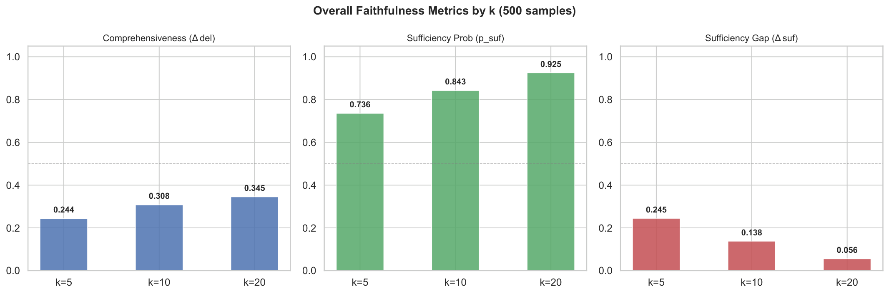
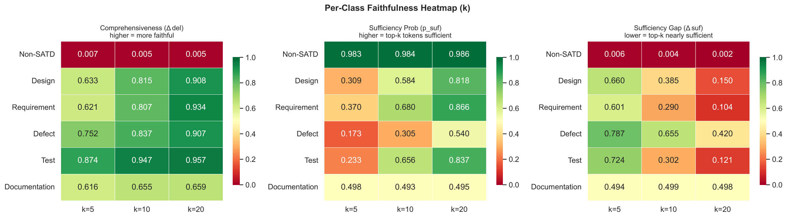
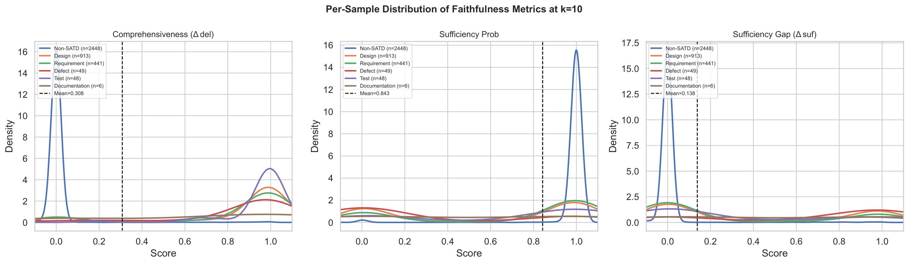
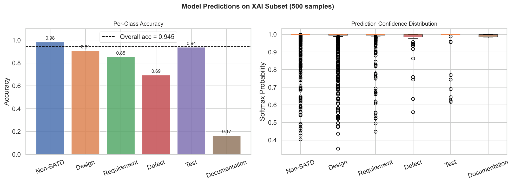
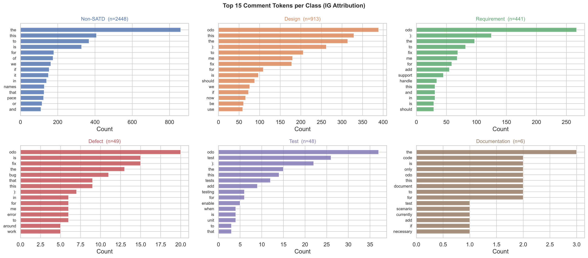
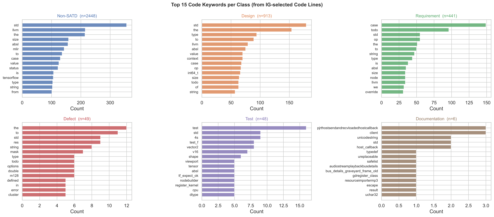
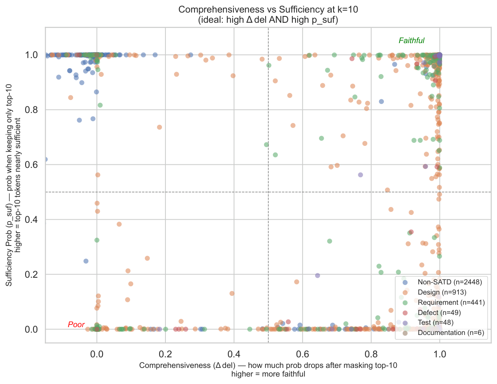
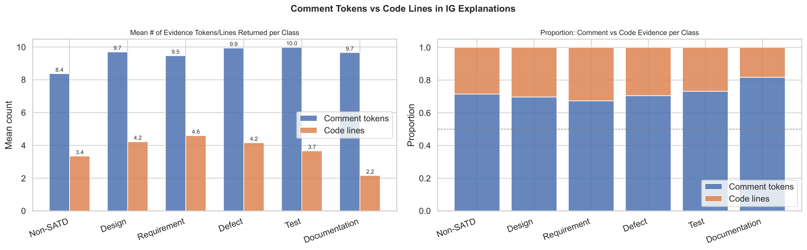
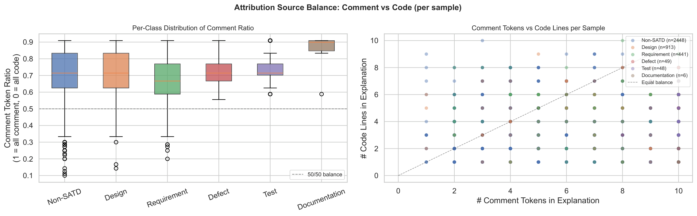

# CppSATD — Self-Admitted Technical Debt in C++ Projects

> All metrics are **macro-averaged** on the test set (80/10/10 stratified split, seed=42).  
> Each row shows the best-performing LR for that encoder/combo, ranked by macro F1.

---

## Phase 1 — Comment-only Baselines

| Rank | comment_encoder | Accuracy | Precision | Recall | F1 |
|------|----------------|----------|-----------|--------|----|
| 🥇 1 | `microsoft/deberta-base` | 0.9385 | 0.8033 | 0.7626 | **0.7771** |
| 🥈 2 | `roberta-base` | 0.9288 | 0.8436 | 0.7364 | **0.7445** |
| 🥉 3 | `bert-base-uncased` | 0.9288 | 0.8576 | 0.6902 | **0.7271** |

## Phase 2 — Code-only Baselines

| Rank | code_encoder | Accuracy | Precision | Recall | F1 |
|------|-------------|----------|-----------|--------|----|
| 🥇 1 | `microsoft/unixcoder-base-nine` | 0.6869 | 0.5298 | 0.4660 | **0.4863** |
| 🥈 2 | `microsoft/graphcodebert-base` | 0.6444 | 0.4309 | 0.4810 | **0.4495** |
| 🥉 3 | `microsoft/codebert-base` | 0.6362 | 0.4302 | 0.4776 | **0.4440** |

## Phase 3 — Late-Fusion Dual Encoder

| Rank | comment_encoder | code_encoder | Accuracy | Precision | Recall | F1 |
|------|----------------|--------------|----------|-----------|--------|----|
| 🥇 1 | `microsoft/deberta-base` | `microsoft/graphcodebert-base` | 0.9373 | 0.7639 | 0.7687 | **0.7640** |
| 🥈 2 | `microsoft/deberta-base` | `microsoft/unixcoder-base-nine` | 0.9345 | 0.7488 | 0.7649 | **0.7530** |
| 🥉 3 | `roberta-base` | `microsoft/unixcoder-base-nine` | 0.9325 | 0.8457 | 0.7335 | **0.7445** |
| 4 | `roberta-base` | `microsoft/graphcodebert-base` | 0.9319 | 0.7724 | 0.7400 | **0.7438** |
| 5 | `bert-base-uncased` | `microsoft/unixcoder-base-nine` | 0.9299 | 0.7501 | 0.7240 | **0.7252** |
| 6 | `microsoft/deberta-base` | `microsoft/codebert-base` | 0.9348 | 0.7161 | 0.7329 | **0.7222** |
| 7 | `bert-base-uncased` | `microsoft/codebert-base` | 0.9379 | 0.6935 | 0.6955 | **0.6944** |
| 8 | `bert-base-uncased` | `microsoft/graphcodebert-base` | 0.9370 | 0.6801 | 0.6939 | **0.6861** |
| 9 | `roberta-base` | `microsoft/codebert-base` | 0.9282 | 0.6780 | 0.6869 | **0.6821** |

## Phase 4 — Cross-Attention Dual Encoder

| Rank | comment_encoder | code_encoder | Accuracy | Precision | Recall | F1 |
|------|----------------|--------------|----------|-----------|--------|----|
| 🥇 1 | `microsoft/deberta-base` | `microsoft/unixcoder-base-nine` | 0.9376 | 0.8184 | 0.7610 | **0.7815** |
| 🥈 2 | `roberta-base` | `microsoft/unixcoder-base-nine` | 0.9356 | 0.8431 | 0.7461 | **0.7483** |
| 🥉 3 | `microsoft/deberta-base` | `microsoft/graphcodebert-base` | 0.9336 | 0.7790 | 0.7239 | **0.7400** |

---

## XAI Faithfulness Analysis — Best Model (Phase 4)

> Model: `deberta-base + unixcoder-base-nine` (Cross-Attention) · Attribution method: Integrated Gradients (IG)  
> Evaluated on the full test split (n = 3,905). Metrics: **Comprehensiveness** (Δdel — higher = more faithful), **Sufficiency** (p_suf — higher = top-k tokens sufficient), **Sufficiency Gap** (Δsuf = p_orig − p_suf — lower = better).

### Overall Faithfulness Metrics by k

*Bar chart showing mean Comprehensiveness (Δdel), Sufficiency Probability (p_suf), and Sufficiency Gap (Δsuf) at k = 5, 10, 20. p_suf increases rapidly with k while the sufficiency gap closes, indicating that a moderate number of top tokens already captures most of the model's decision signal.*

---

### Per-Class Faithfulness Heatmap

*Heatmap of faithfulness metrics across all six SATD classes and three k values. SATD classes (Design, Requirement, Defect, Test) consistently achieve high Comprehensiveness (> 0.8 at k=10), while Non-SATD shows near-zero Δdel — suggesting the model identifies Non-SATD through the **absence** of SATD signals rather than specific tokens.*

---

### Per-Sample Faithfulness Distribution (k = 10)

*KDE distributions of per-sample faithfulness metrics at k=10 separated by true class. Non-SATD forms a sharp spike near 0 for Δdel and near 1 for p_suf, while all SATD sub-types spread across higher Δdel values, confirming the dichotomy between SATD and Non-SATD explanation behavior.*

---

### Prediction Accuracy & Confidence by Class

*Left: per-class accuracy on the XAI evaluation subset. Right: boxplot of softmax prediction confidence per class. Non-SATD achieves near-perfect accuracy with very high confidence, whereas minority SATD classes (Test, Defect, Documentation) show wider confidence distributions.*

---

### Top Comment Tokens per Class (IG Attribution)

*Top-15 most frequently attributed comment tokens per class derived from Integrated Gradients. Each class exhibits distinctive vocabulary: "fix" / "bug" for Defect, "todo" / "should" for Design, test-related terms for Test — validating that IG captures semantically meaningful, class-specific evidence from comment text.*

---

### Top Code Keywords per Class (IG Attribution)

*Top-15 C++ code keywords attributed by IG for each SATD class (C++ stop-words removed). Reveals that the model leverages code-side signals (e.g., data-structure types for Defect, interface/method names for Design) in addition to comment tokens, demonstrating the utility of multimodal fusion.*

---

### Comprehensiveness vs Sufficiency Scatter (k = 10)

*Scatter plot of Δdel vs p_suf at k=10 for all test samples colored by true class. Ideal explanations cluster in the top-right quadrant (high Δdel AND high p_suf). SATD classes concentrate there, while Non-SATD clusters near the bottom-left of Δdel, forming a clear bimodal separation.*

---

### Comment vs Code Evidence Count per Class

*Left: mean number of attributed comment tokens and code lines returned per class. Right: proportion of comment vs code evidence per class. Design and Requirement lean more on comment tokens, while Defect and Test rely relatively more on code lines — reflecting the nature of each debt type.*

---

### Attribution Source Balance — Comment vs Code (per sample)

*Left: per-class boxplot of the comment token ratio (1 = explanation entirely from comment, 0 = entirely from code). Right: scatter of comment token count vs code lines per sample. Most classes favor comment tokens, but with meaningful variance, supporting the value of including code context in the fusion model.*
